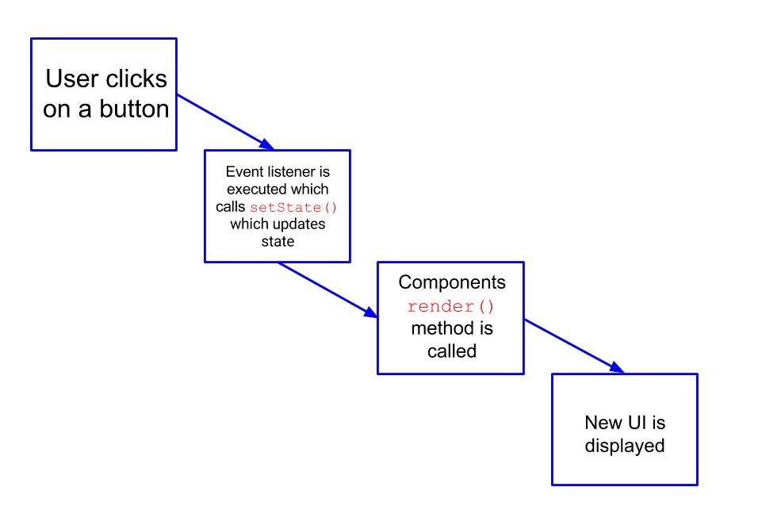

# Props and State in React

This lecture is going to explore `props` and `state` in React. So far we've seen quite a bit of React. Today we've seen:

* JSX - an XML-like syntax for generating HTML
* Components - a fundamental building block of React

## Learning Objectives

By the end of this lecture you should be comfortable *doing* the following:

* Describe the difference between props and state
* Render props passed to a component
* Render a component's state
* Use `setState()` to update a components state

## Props and State: A First Look

We know that `props` and `state` are how we represent data in React. What is data you ask? Data could be:

* a list of posts for a given user
* a single task on a To Do list
* the contents of an e-mail

In the context of React data is *anything* we want to display to the user.

We know `props` are immutable. We simply pass `props`
from parent to child component. The child component then typically renders this data. **A component does not alter its props object**. Let's take a look at the [example below](https://codepen.io/jtamsut/pen/ZKwQWO).

> Let's build this simple example.

```js
import React, {Component} from 'react';
import ReactDOM from 'react-dom';

class ParentComponent extends Component {
	constructor() {
		super();
		this.state = {foo: "bar"};
	}

	render() {
    return (
      <ChildComponent foo={this.state.foo} />
    )
	}
}

const ChildComponent = (props) => {
	return (
		<div>{props.foo}</div>
	)
}

ReactDOM.render(<ParentComponent />, document.getElementById('root'));
```

> Definition: An attribute on a component is any key-value pair separated by a "=" written on a component invocation.

There are a few things to note in the above example:

* We are **initializing** state in our class `constructor()` method
	- Every time we create a new instance of our `<ParentComponent />` component we execute the `<ParentComponent />` constructor method
* `props` are passed to child components as attributes of a component. In our example, our child component is the `<ChildComponent />` component which has an attribute that has a key of `foo` and a value of `{this.state.foo}`
* `<ChildComponent />` is **NOT** altering the `props` object passed to it; it simply extracts the data from the props object and renders it
* If we were to log out `props` in `<ChildComponent />` what would be logged out would be this:

```js
Object {
	foo: "bar"
}
```

**Quiz**: What type of component is `<ParentComponent />`? What type of component is `<ChildComponent />`?

##### You Do (15 minutes)

**TASK**: Add to our initial state declaration in `<ParentComponent />`. Create a property on `this.state` called `friends` with a value of `["Nick", "Annie", "Marc"]`. Then pass this array as a prop named `friends` to `<ChildComponent />`. Lastly use `map` to create a list of `<div>`'s for each friend (e.g., `[<div>Nick</div>, <div>Annie</div>, <div>Marc</div>]`) and render each element in this array to the DOM.

## Initializing State is Very Very Very Very Different Than Updating State

**Quiz**: Where do we initialize state in a React component?

**Only the component that initialized the state can change the state**.

**Question**: What if something happens on a child component that makes us want to alter state. *In other words how does a child component alter an ancestor's state*?
<br>
**Answer**: The parent component must pass a callback function to the child component.

Let's take a look at an [example](https://codepen.io/jtamsut/pen/VbgaeO) of this:

```js
class ParentComponent extends React.Component {
	constructor() {
    super();
		this.state = {counter: 0};
	};

	updateCounter = () => {
		this.setState(currentState => {
			return {
				counter: currentState.counter + 1
			}
		})
	};

	render() {
		return (
			<div>
        <h2>Clock</h2>
        <Clock updateCounter={this.updateCounter} counter={this.state.counter} />
			</div>
		)
	}
}

const Clock = ({updateCounter, counter}) => {
	return (
    <div>
      <button onClick={updateCounter}>Increment</button>
      <div>{counter}</div>
    </div>
   )
}

ReactDOM.render(<ParentComponent />, document.getElementById("root"));
```

Things to note about the above code snippet:

* The `updateCounter` method is altering the state of the component it is written in!
* We are passing `updateCounter` as a `prop` to `<Clock />`

##### You Do (10 minutes)

Implement decrement functionality to our counter. This include a "Decrement" button and a new method on `<ParentComponent />` to update state.

## setState Calls A Components render() Method

Whenever `setState()` is called two things happen:

1. First, state is updated.
2. Next, the component in which the aforementioned state was defined has its `render()` method called



A component cannot alter its `props` object. The only way for `props` to change is for `setState` to be called, which in turn calls the component's (the component that owns the state that is) `render` method.

Remember that the `render()` method is required in all components. When called it should examine `this.props` and `this.state` and return a single React element.

## Two Commandments of State

There a two important things to note about state. I like to call them the *Three Commandments of State*.

### 1. Thou shalt not alter `state` directly

```js
// WRONG
this.state.comment = "Hello";
```

```js
// OH SO RIGHT
this.setState({comment: "Hello"});
```

This is because `setState()` is a *special* function that does Virtual DOM "magic".

**The only place where you can assign `this.state` is the constructor**

### 2. Thou shall assume that `this.state` and `this.props` may be updated asynchronously

```js
// Wrong
this.setState({
  counter: this.state.counter + 1
});
```
```js
// Correct
this.setState((prevState) => ({
  counter: prevState.counter + 1
}));
```

Above we have a callback passed to `setState()` that will update the `counter` property in `state`. Note that we are *updating a currently existing property on state not creating a new one**. In a complex application you may be updating a currently existing property in two ways simultaneously. Using a callback ensures that the second update does overwrite the first one.

## React's Uni-Directional Data Flow

From React docs:

<center>
*[Passing props from parent to child component] is commonly called a "top-down" or "unidirectional" data flow. Any state is always owned by some specific component, and any data or UI derived from that state can only affect components "below" them in the tree.

If you imagine a component tree as a waterfall of props, each component's state is like an additional water source that joins it at an arbitrary point but also flows down.*
</center>

## PropType Validation

The `propTypes` object allows you to validate props being passed to your components. To validate `props` you must import the `prop-types` library. With `propTypes` you can type check a `prop`.

Let's take a look at [this](https://codepen.io/jtamsut/pen/OmdXro) in action.

## Where to Put State

For each piece of state in your application:

* Identify every component that renders something based on that state.
* Find a common owner component (a single component above all the components that need the state in
the hierarchy).
* Either the common owner or another component higher up in the hierarchy should own the state.
* If you can't find a component where it makes sense to own the state, create a new component simply for
holding the state and add it somewhere in the hierarchy above the common owner component

From React documentation:

<center>
*When you want to aggregate data from multiple children or to have two child components communicate with each other, move the state upwards so that it lives in the parent component. The parent can then pass the state back down to the children via props, so that the child components are always in sync with each other and with the parent.*
</center>
