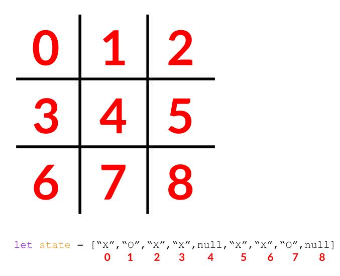

# Comparative DOM Manipulation

The goal of this exercise is to practice the tools you've been learning this week. Our goal is to build a Tic-Tac-Toe game twice:

1. First, using React
2. Then, using an object-orientated approach in jQuery

### General Requirements

Here are the requirements both versions of your Tic-Tac-Toe game must meet:

* Display an empty Tic-Tac-Toe board when the page is initially displayed
* A player can click on the nine cells to make a move
* Every click will alternate between marking an X and O
* Once occupied with an X or O, the cell cannot be played again
* Once someone has won display a message informing the user(s) of this

### React Tic-Tac-Toe

Build Tic-Tac-Toe in React. Use `create-react-app`. The file structure for your `src` directory should look like this:

```
 src
  |-index.js
  |-index.css
  |-components
  |     |-Board.js
  |     |-Game.js
  |     |-Square.js
  |
  |-utils
      |-calculateWinner.js
```

This is what `index.js` should look like:

```js
import React from 'react';
import ReactDOM from 'react-dom';
import Game from './components/Game';
import './index.css';

ReactDOM.render(<Game />, document.getElementById('root'));
```

This is what `index.css` should have in it:

```css
body {
  font: 14px "Century Gothic", Futura, sans-serif;
  margin: 20px;
}

ol, ul {
  padding-left: 30px;
}

.board-row:after {
  clear: both;
  content: "";
  display: table;
}

.status {
  margin-bottom: 10px;
}

.square {
  background: #fff;
  border: 1px solid #999;
  float: left;
  font-size: 24px;
  font-weight: bold;
  line-height: 34px;
  height: 34px;
  margin-right: -1px;
  margin-top: -1px;
  padding: 0;
  text-align: center;
  width: 34px;
}

.square:focus {
  outline: none;
}

.kbd-navigation .square:focus {
  background: #ddd;
}

.game {
  display: flex;
  flex-direction: row;
}
```

Your component hierarchy should look like this:

```
<Game>
  <Board>
    <Square />
    <Square />
    <Square />
    <Square />
    <Square />
    <Square />
    <Square />
    <Square />
    <Square />
  </Board>
</Game>
```

The `<Game />` component should live in `/components/Game.js`. This is what your `Game.js` file should have in it:

```js
import React from 'react';
import Board from './Board';

class Game extends React.Component {
  render() {
    return (
      <div className="game">
        <div className="game-board">
          <Board />
        </div>
      </div>
    );
  }
}

export default Game;
```

Your `<Board />` component (written in `Board.js`) should be where `state` is initialized. This is what the constructor method of `<Board />` should look like:

```js
class Board extends React.Component {
  constructor() {
    super();
    this.state = {
      squares: Array(9).fill(null),
      xIsNext: true,
    };
  }
//.
//. Class Methods go here
//.
}
```
In `Board.js` you need to:

* `render()` 9 `<Square />` components. Each `<Square />` component should correspond to a cell on the Tic-Tac-Toe board
* You will need to pass a function as a `prop` from `<Board />` to `<Square />` to update the `this.state.squares` array defined in `<Board />` when a user clicks a `<Square />`
* You should also check for a winner somewhere in your `<Board />` component

Below should be *ALL* the code in `Square.js`:

```js
import React from 'react';

const Square = (props) => {
  return (
    <button className="square" onClick={props.onClick}>
      {props.value}
    </button>
  );
};

export default Square;
```

`<Square />` is a stateless functional component.

**Note**: I have given you all the code you need for the following files:

* `Game.js`
* `Square.js`
* `index.css`
* `index.js`

#### Win Condition

Here is a function you can use to determine a winner:

```js
function calculateWinner(squares) {
  const lines = [
    [0, 1, 2],
    [3, 4, 5],
    [6, 7, 8],
    [0, 3, 6],
    [1, 4, 7],
    [2, 5, 8],
    [0, 4, 8],
    [2, 4, 6],
  ];
  for (let i = 0; i < lines.length; i++) {
    const [a, b, c] = lines[i];
    if (squares[a] && squares[a] === squares[b] && squares[a] === squares[c]) {
      return squares[a];
    }
  }
  return null;
}
```

Things to note about the `calculateWinner` function:

* It takes an array as an argument
* Each element in the array must be a `"X"`, `"O"` or `null`
* It returns:
  - `"X"` if "X" is the winner
  - `"O"` if "O" is the winner
  - `null` if there is no winner

Here is a diagram for how array elements map to cells on the board:



### jQuery Tic-Tac-Toe

Now that you've built out a game using React let's do it again using jQuery. Let's take an object object-orientated approach to this. We will have a single JS class called `Board`. In this class we will put all of our class methods. Instantiate state in the constructor method of this class.

This will be a Node application.

You must initialize this application using `npm`. In the directory you create run:

```
$ npm init -y
```

Then install Express:

```
$ npm i express --save
```

You should have the following file structure:

```
|-public
|    |-app.js
|    |-checkWinner.js
|    |-index.css
|    |-index.html
|   
|-server.js
```

Your `server.js` file should look like this:

```js
const express = require('express');
const app = express();

app.use(express.static('public'))

app.listen(3000);
```

Use the `calculateWinner` function to determine the winner.

## Conclusion

* What were the difference between implementing this in React and jQuery?
* What patterns did React enforce that jQuery did not?
