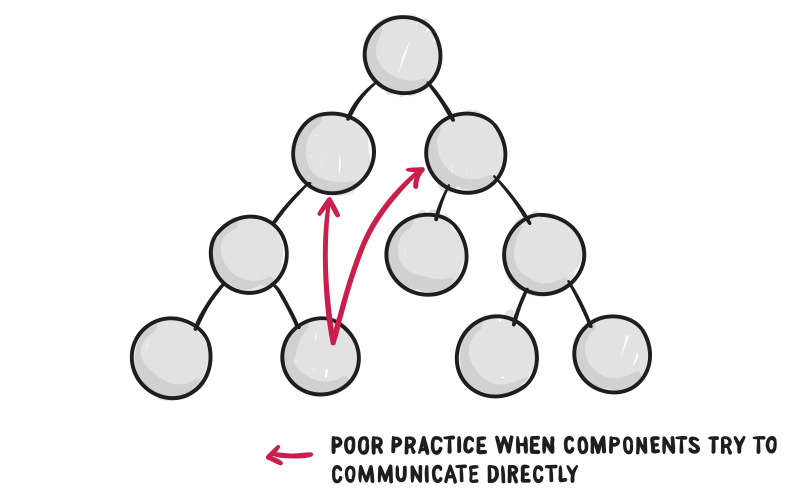
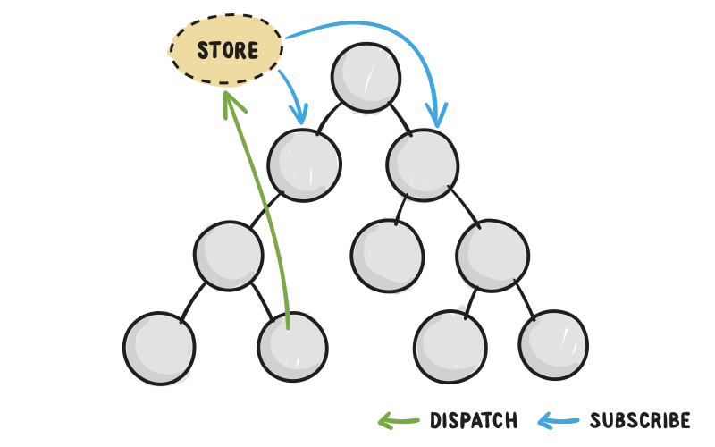

# Introduction to Redux

# Learning Objectives 

* Understand the use case of Redux 
* Understand the role of the store, actions and reducers 
* Be able to reason about a simple Redux loop

## Key Concepts of Redux 

Today we are going to learn Redux. Redux is a set of ideas that can be used to build a component-based UI that scales well. Redux is a state management architecture. Redux is **NOT** a part of the React library. Redux can be used with jQuery or Angular as well as React.

Redux was created with React in mind, but we can think of it as an independent set of ideas. The goal of Redux is to try to make state updates predictable. We use Redux to allow components to update state and then subsequently render (or display) this updated state.

We can quickly run into serious issues when we have components trying to access state from one another and trying to pass props to one another. Typically we pass props from parent to child component. In order to facilitate this uni-directional data flow we want to have a single source of state that can pass data *down* to all components.



In the diagram below we have a single store. One characteristic of an application that conforms to Redux architecture is that it has a single store. Components then **dispatch** state changes to the store and not directly to other components. We say that the components that need to be aware of state changes can **subscribe** to the store.

######in class notes:
store - holds all state (this is a single JS object), store is immutable, to update you clone then modify  
action - description of how state will change  
reducer - pur function - reducer(prev state, action) -> new state (aka new store)  
whenever state changes, components that subscribe to store re-rener new data  
Redux loop: {store} -> (subscribe) -> components that dispatch action & components that display store data -> emit action -> reducer (prevState, action) -> {store/newstore}  
pure functions - nested functions can be pure as long as in scope  




All state changes must go through the store in a Redux architecture.

## A Brief Interlude: Functional Programming 

The creators of Redux *really* liked functional programming. Functional programming makes code easier to understand and easier to debug. I want to briefy cover some of the terminology and concepts of functional programming before discussing Redux itself. A **function** is a piece of code that can be invoked at some later time. In JavaScript a function can return a number, string, object, another function or undefined. 

```js
function addTwo(a,b) {
    return a+b;
}
```

One of the main ways we use functions is to **map some inputs to some outputs.** For example we could say that our `addOne` function below maps `1` to `2` and maps `156` to `157` and so on.

```js
function addOne(a) {
    return a + 1;
}
``` 

When we write **pure functions** we write a function that simply map their parameter(s) (or input(s)) to some output(s). The defining features of pure functions are:

* Given the same input a pure function will always return the same output 
* Pure functions produce no side effects meaning that they only affect data that lives in the function
* Pure functions rely on no external data to do their computations 

Later on when we introduce the concept of **reducers** we will see that reducers are pure functions.

## Core Ideas Behind Redux 

Redux is actually very simple. That is the point of Redux - to be simple. With Redux we define the *entirety* of our state in a **single** JS object called the **store**. 

```js
// An example store 
{
  todos: [{
    text: 'Eat food',
    completed: true
  }, {
    text: 'Exercise',
    completed: false
  }],
  visibilityFilter: 'SHOW_COMPLETED'
}
```

The **ONLY** way to change the state is to emit an action, which is an object describing the change. Here are a few examples of actions:

```js
{ type: 'ADD_TODO', text: 'Go to swimming pool' }
{ type: 'TOGGLE_TODO', index: 1 }
{ type: 'SET_VISIBILITY_FILTER', filter: 'SHOW_ALL' }
```

Since every state change is **explicitly** defined by an action it's easier to see *HOW* your state can change.

To link actions and state together we write a **reducer**. A reducer is just a function that takes state and action as arguments and returns the next state of the application. Here is an example of two reducers for a given application:

```js
function visibilityFilter(state = 'SHOW_ALL', action) {
  if (action.type === 'SET_VISIBILITY_FILTER') {
    return action.filter;
  } else {
    return state;
  }
}

function todos(state = [], action) {
  switch (action.type) {
  case 'ADD_TODO':
    return state.concat([{ text: action.text, completed: false }]);
  case 'TOGGLE_TODO':
    return state.map((todo, index) =>
      action.index === index ?
        { text: todo.text, completed: !todo.completed } :
        todo
   )
  default:
    return state;
  }
}
```

Typically if we have more than one reducer we can combine them to make our code even more understandable. The `todoApp` function below returns an object with our two reducers.

```js
function todoApp(state = {}, action) {
  return {
    todos: todos(state.todos, action),
    visibilityFilter: visibilityFilter(state.visibilityFilter, action)
  };
}
```
## Three Principles of Redux 

### Redux Loop

1. **First**: The whole state of app is represented by a *SINGLE* JS object. Everything that changes in you application including the UI and data is represented by a JS object called state.

2. **Second**: The state object is **READ ONLY** meaning you cannot modify or write to it. Any time you want to change state you must dispatch an **action**. An action is a plain JS object describing the change. The action is a "minimal representation" of the change to that data. An action must have a type property. 

3. **Third**: All state mutations are done by a reducer which is a function that takes in two parameters: previous state and an action. A reducer returns the updated state of an application.

## Redux in Action: ToDo Application

We will be building a Todo application today. Let's see it in action [here](http://localhost:3000/)

To build this application we will be using a few libraries:

```bash
$ npm install redux react-redux prop-types redux-undo
```

The `react-redux` and `redux` libraries allow us to use built-in Redux methods in our React application. The `redux-undo` module allows us to go back to a previous state while `prop-types` will be used for PropType validation.

## Understanding Checklist:

### React-Redux 

* `connect()`
* `ActionCreators`
* `Prodvider`

### Concepts

* Map state to props 
* Map dispatch to props

## Redux 

* `combineReducers`
* `createStore`

## redux-undo 

* `undoable`
