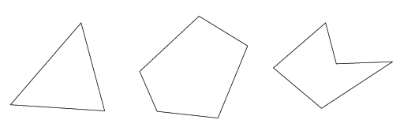

## Intro SVG and D3

## Learning Objectives

* Be able to create basic shapes in D3 and SVG
* Understand the SVG coordinate system
* Have a basic understanding of D3 selections and data joins

## What is SVG

**Scalable Vector Graphics** or SVG is an [XML-like](https://en.wikipedia.org/wiki/XML) *language* that is used to draw 2-D graphics. SVG can be written in HTML by adding an `<svg>` tag to an HTML page. With SVG we use text to specify what an image will look like. An SVG image is made up of a series of **polygons** and **arcs**. A polygon is a shape made up of 3 or more lines. An arc is a curved line. It should be noted that SVG's can exist outside of HTML pages as standalone images.



The shape of a polygon is specified using the SVG coordinate system. Each point (x-y coordinate) is specified and the points are connected by lines to construct a polygon. The points are specified as attributes in an SVG element as we'll see below.


Let's serve up our examples locally by running in the `examples` directory:

```bash
$ python -m SimpleHTTPServer 3000
```

## Example Uno: A Purple Circle

When we want to create an SVG we need to include an `<svg>` element in our HTML. The `<svg>` tag is called the root element. You can think of the `<svg>` tag as being a canvas on which your SVG shapes are rendered. We define a width and height to this canvas.

Let's open up a text editor and type this.

```HTML
<!DOCTYPE html>
<html>
  <head>
    <meta charset="utf-8">
    <title>Circle</title>
  </head>
  <body>
    <svg width="50" height="50">
      <circle cx="25" cy="25" r="25" fill="purple" />
    </svg>
  </body>
</html>
```
In an SVG opening tag (e.g., `<svg width="50" height="50">`) we declare the width and height of our "canvas".

The `cx` and `cy` attributes specify the center of our circle using SVG coordinates and the `r` attribute specifies the radius of our circle. Let's [see](http://localhost:3000/svg/circle.html) what this looks like.

SVG comes out of the box with support for a few basic shapes:

  * `<circle>`
  * `<rect>`
  * `<line>`

Let's take a look at a [square](http://localhost:3000/svg/square.html) and a [polyline](http://localhost:3000/svg/polyline.html).

The order in which elements are coded determines their depth order. Let's take a look at `svg_ordering.html` and [see](http://localhost:3000/svg/svg_ordering.html) what it looks like when its rendered in the browser.

[Here](http://localhost:3000/svg/bar_chart.html) is an example of an `<svg>` element with two shapes. It's a simple bar chart.

**You Do**:  In Code Pen make an SVG `<rect>`. Try moving it around and changing its shape and color.

## Introduction to D3.js

D3.js is a JavaScript library that allows you to create interactive visualizations like [this](https://bl.ocks.org/mbostock/3231298). D3 allows us to manipulate the DOM to create *interactive* visualizations that can change based on DOM events. It provides us with a simpler way to make complex SVG graphics using data.

## Two Core Concepts of D3.js: Selections and Data Joins

Let's create a bar chart in D3.js. In doing so we will get a better sense of the fundamental concepts of D3.js. There are two fundamental concepts from which the entire D3 library is based upon:

  1. **Selectors** allow you to select DOM nodes (SVG elements, `<p>`, `<h1>`)
  2. **Data joins** allow you to dynamically render SVG elements that reflect your data

You should follow along in `example/d3_example.html`.

Before we dive into our example let's start off by seeing an example of *selection*. Write the code below in `d3_boilerplate.html`.

```js
var body = d3.select("body");
var div = body.append("div");
div.html("Hello, world!");
```

We can see that this is similar to jQuery. We are selecting a DOM node then doing something to it. Now let's work on our bar chart.

#### Step 1: Creating an SVG Element

Just like jQuery, in order to manipulate the DOM we first must select a DOM node. D3 allows us to do this using the `d3.select(<type>)` which selects a single DOM node of a given `<type>`. We can also use `d3.selectAll(<type>)` to select all DOM  nodes of a given `<type>`.

`d3` is the global D3 object. Similar to jQuery the `d3` object "injects" functionality into the DOM node it selects.

**Something to Ponder**: How can we list all of the properties on the `d3` object.

We can select the `<body>` element:

```js
d3.select('body').append('svg');
```
`d3` is to D3.js as `$` is to jQuery. In the above we are selecting the `<body>` tag and appending the `<svg>` DOM node to it.

Selecting something in D3 produces what's called a D3 **selection**. Selections actually allow us to select DOM nodes that **do not currently exist.** A selection returns a `d3` object.

We can also use the `attr()` method on a D3 object to give an SVG element attributes. Let's actually write some code for our bar chart now that we've see the `select()`, `append()` and `attr()` methods.

```js
//Width and height
const w = 500;
const h = 100;
const barPadding = 1;

const dataset = [ 5, 10, 13, 19, 21, 25, 22, 18, 15, 13,
        11, 12, 15, 20, 18, 17, 16, 18, 23, 25 ];

//Create SVG element
const svg = d3.select("body")
      .append("svg")
      .attr("width", w)
      .attr("height", h);
```

In the above example we have:

  1. Selecting the `<body>` tag
  2. Appended an `<svg>` tag to it
  3. Set the width and height attributes of the `<svg>` tag

Now that we have an `<svg>` root element let's draw some shapes. Below our previous code in the `<script>` tag let's add the following code:

## Step 2: Joining Data

```js
svg.selectAll("rect")
   .data(dataSet)
   .enter()
   .append("rect")
   .attr("x", function(d, i) {
      return i * (w / dataSet.length);
   })
   .attr("y", function(d) {
      return h - (d * 4);
   })
   .attr("width", w / dataSet.length - barPadding)
   .attr("height", function(d) {
      return d * 4;
   });
```

The line `.data(dataset)` is our **data join**. We iterating through the `svg.selecAll(rect)` selection and in turn associating a datum with a `<rect>` SVG element.

It should be noted that the line `svg.selectAll("rect")` is selecting all `<rect>` tags on the page when their currently are none! This is a feature of selections that difference from jQuery. We can select DOM nodes that currently do not exists and D3 will not return a empty object.

### Data Joins: Another Example

Let's take a look at another example. Inside the `<script>` tag of an HTML page write the following:

```js
const svg = d3.select('body').append('svg').attr('width', 1000).attr('height', 1000)

const cities = [
  {name: 'London', population: 8416500, continent: 'Europe'},
  {name: 'New York City', population: 8419000, continent: 'North America'},
  {name: 'Paris', population: 2241000, continent: 'Europe'},
  {name: 'Shanghai', population: 24150000, continent: 'Asia'},
  {name: 'Tokyo', population: 13297000, continent: 'Asia'},
];

cities.push({name: 'Madrid', population: 3165000, continent: 'Europe'});

const radiusScale = d3.scaleSqrt().domain([0, 25000000]).range([0, 50]);


const mySelection = svg.selectAll('circle').data(cities).enter().append('circle').attr('r', function(d) {
  return radiusScale(d.population);
  })
  .attr('cx', 200)
  .attr('cy', function(d,i) {
      // Write code here
  })
```

What do you see? What's wrong? How can we fix it?
