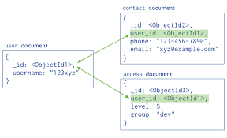
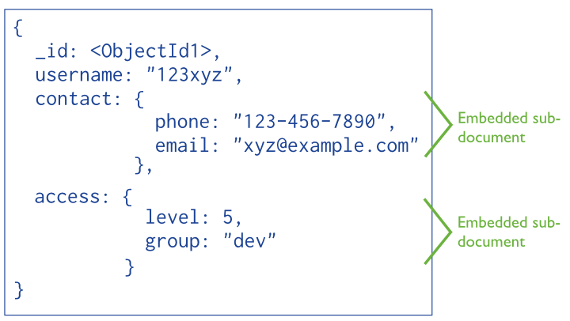

# Data Modeling with MongoDB

---

## What is Data Modeling?

What is data modeling?

---

## Objectives

* Understand model relationships in MongoDB
* Understand **one-to-many** relationships in the context of MongoDB
* Understand **many-to-many** relationships in the context of MongoDB
* Reinforce the difference between embedding and referencing

---

## Recap

* Data in MongoDB has a flexible schema
* Unlike SQL databases, where you must determine and declare a table’s schema before inserting data, MongoDB’s collections do not enforce document structure
* This flexibility facilitates the mapping of documents to an entity or an object
* Each document can match the data fields of the represented entity, even if the data has substantial variation

---

## Normalized vs. Denormalized Data

Roughly speaking a **normalized** data set has no redundant data, while **denormalized** data has some duplicates of data.

---

## Recap: References vs Embeds

#### References

* References store the relationships between data by including links or references from one document to another. Applications can resolve these references to access the related data. Broadly, these are normalized data models.




#### Embedded Data

* Embedded documents capture relationships between data by storing related data in a single document structure. MongoDB documents make it possible to embed document structures in a field or array within a document. These denormalized data models allow applications to retrieve and manipulate related data in a single database operation.



#### Examples

Emdedding documents using Mongoose:

```javascript
var Comments = new Schema({
    title     : String,
    body      : String,
    date      : Date
});

var BlogPost = new Schema({
    author    : ObjectId,
    title     : String,
    body      : String,
    date      : Date,
    comments  : [Comments],
    meta      : {
        votes : Number,
        favs  : Number
    }
});

mongoose.model('BlogPost', BlogPost);
```

---

This is how you add an embedded document to an array:

```javascript
  // retrieve my model
var BlogPost = mongoose.model('BlogPost');

// create a blog post
var post = new BlogPost();

// create a comment
post.comments.push({ title: 'My comment' });

post.save(function (err) {
  if (!err) console.log('Success!');
});
```

This is how you remove an embedded document

```javascript
BlogPost.findById(myId, function (err, post) {
  if (!err) {
    post.comments[0].remove();
    post.save(function (err) {
      // do something
    });
  }
});
```

* This might be how you'd find embedded objects by their `id`
* `DocumentArrays` have an special method `id` that filters your embedded documents by their `_id` property (each embedded document gets one):

```javascript
post.comments.id(my_id).remove();
post.save(function (err) {
  // embedded comment with id `my_id` removed!
});
```

---

### When to embed? When to reference?

* Both embedding and referencing have their strengths and weaknesses.
* Unlike the strict structure of relational DB's, data modeling in MongoDB is more art than science due to MongoDB's unique flexibility
* Without going into to much detail, here is a quick recap of some of the key points of when to use either referencing or embedding when considering your application's data model:

1. Referencing
  * good when you need more flexibility
  * good when you have a many-to-many relationship

2. Embedding
  * good when the sub object always appears with it's parent. Like a comment to a post
  * good when you have a one-to-many relationship

---

### A Basic One-to-Many Example

* Recap: In relational databases, a one-to-many relationship occurs when a parent record in one table can potentially reference several child records in another table. In a one-to-many relationship, the parent is not required to have child records; therefore, the one-to-many relationship allows zero child records, a single child record or multiple child records. The important thing is that the child cannot have more than one parent record.


---

### Modeling One-to-Many Relationships with Embedded Documents

Consider the following example that maps a user and multiple address relationships. The example illustrates the advantage of embedding over referencing if you need to view many data entities in context of another. In this one-to-many relationship between user and address data, the user has multiple address entities.

In the normalized data model, the address documents contain a reference to the patron document.

### Embedded

```js
var mongoose = require('mongoose');

var addressSchema = new mongoose.Schema({
    street: String,
    city: String,
    cc: String
});

var userSchema = new mongoose.Schema({
    name: String,
    ssn: String,
    addresses: [addressSchema]
});

module.exports = mongoose.model('User', userSchema);
```

### Usage

```js
var user = new User({
    name: 'Kate Monster',
    ssn: '123-456-7890',
    addresses : [
        { street: '123 Sesame St', city: 'Anytown', cc: 'USA' },
        { street: '123 Avenue Q', city: 'New York', cc: 'USA' }
  ]
});

user.save();

// or
user.addresses.push({street: 'bancroft pkwy', city: 'wilmington', country: 'usa'});
```
### Output

```js
{
  name: 'Kate Monster',
  ssn: '123-456-7890',
  addresses : [
     { street: '123 Sesame St', city: 'Anytown', cc: 'USA' },
     { street: '123 Avenue Q', city: 'New York', cc: 'USA' }
  ]
}
```

**If your application frequently retrieves the address data with the name information, then your application needs to issue multiple queries to resolve the references. A more optimal schema would be to embed the address data entities in the patron data, as in the following document**

---

### Modeling One-to-Many Relationships with Document References

Consider the following example that maps products and order relationships. The example illustrates the advantage of referencing over embedding to avoid repetition of the products information.

```js
var mongoose = require('mongoose');

var orderSchema = new mongoose.Schema({
    products: [{type: mongoose.Schema.Types.ObjectId, ref: 'Product'}]
});

var Order = mongoose.model('Order', orderSchema);

var productSchema = new mongoose.Schema({
    name: String,
    price: Number
});

var Product = mongoose.model('Product', productSchema);
```

### Usage

```js
var product = new Product({name: 'Wrench', price: 5});
product.save();
var order = new Order()
order.products.push(product)
order.products // ["57ec7d5cf292421828791b8b"] // just the objectId
```

### Output

```js
{
    _id: '57ec7d63f292421828791b8c',
    products: [ '57ec7d5cf292421828791b8b' ]
}
```

In order to obtain the referenced documents we need to call `populate` on the query.

```js
Order.findById(id).populate('products').exec(function(err, order){
    console.log(order);
});
```

The `populate` allows you to access another document in a given collection other than the one you are currently query.

### Output

```js
{ _id: '57ec800a3130441eb4b52e39',
  __v: 0,
  products:
   [ { _id: '57ec800a3130441eb4b52e38',
       name: 'Wrench',
       price: 5,
       __v: 0 } ] }
```

---

### Question Checkpoint

Let's review by pondering the following questions:

  * What are Mongo references?
  * What are Mongo embeds?
  * When would you use a reference?
  * When would you use an embed?

---

### Modeling Many to Many Relationships

* Just like one-to-many relationships, many-to-many relationships are important for any application
* Normally we implement these relationships with MongoDB by linking documents via referencing.
* We're going to discuss a few possible ways to model many-to-many relationships and show you how to pick one over another.

---

### A Basic Many to Many Example

* *Recapitulation*: A many-to-many relationship refers to a relationship between tables in a database when a parent row in one table contains several child rows in the second table, and vice versa.


* Another Example
  * product can be in many categories
  * category can have many products

---

### Many to Many

```javascript
var mongoose = require("mongoose"),
    Schema = mongoose.Schema,
    relationship = require("mongoose-relationship");

var ParentSchema = new Schema({
    children:[{ type: mongoose.Schema.Types.ObjectId, ref:"Child" }]
});
var Parent = mongoose.models("Parent", ParentSchema);

var OtherParentSchema = new Schema({
    children:[{ type: mongoose.Schema.Types.ObjectId, ref:"Child" }]
});
var OtherParent = mongoose.models("OtherParent", OtherParentSchema);

var ChildSchema = new Schema({
    parents: [{ type: mongoose.Schema.Types.ObjectId, ref:"Parent", childPath:"children" }]
    otherParents: [{ type: mongoose.Schema.Types.ObjectId, ref:"OtherParent", childPath:"children" }]
});
ChildSchema.plugin(relationship, { relationshipPathName:['parents', 'otherParents'] });
var Child = mongoose.models("Child", ChildSchema)

var parent = new Parent({});
parent.save();
var otherParent = new OtherParent({});
otherParent.save();

var child = new Child({});
child.parents.push(parent);
child.otherParents.push(otherParent);
child.save() //both parent and otherParent children property will now contain the child's id
child.remove()
```

---

## Embedded and Referencing Documents

- One: favor embedding unless there is a compelling reason not to

- Two: needing to access an object on its own is a compelling reason not to embed it

- Three: If there are more than a couple of hundred documents on the “many” side, don’t embed them; if there are more than a few thousand documents on the “many” side, don’t use an array of ObjectID references. High-cardinality arrays are a compelling reason not to embed.

- Four: Don’t be afraid of application-level joins: if you index correctly and use the projection specifier (as shown in part 2) then application-level joins are barely more expensive than server-side joins in a relational database.

- Five: Consider the write/read ratio when denormalizing. A field that will mostly be read and only seldom updated is a good candidate for denormalization: if you denormalize a field that is updated frequently then the extra work of finding and updating all the instances is likely to overwhelm the savings that you get from denormalizing.

- Six: As always with MongoDB, how you model your data depends – entirely – on your particular application’s data access patterns. You want to structure your data to match the ways that your application queries and updates it.

http://blog.mongodb.org/post/87200945828/6-rules-of-thumb-for-mongodb-schema-design-part-1

---

### Conclusion

- referencing allows you to store id's like a table in SQL
- embedding allows you to store a whole child object inside a parent object
- one-to-many in mongo operates very similarly to how we handled it in rails
- many-to-many in mongo operates differently, and there are a couple ways to handle that association

---
